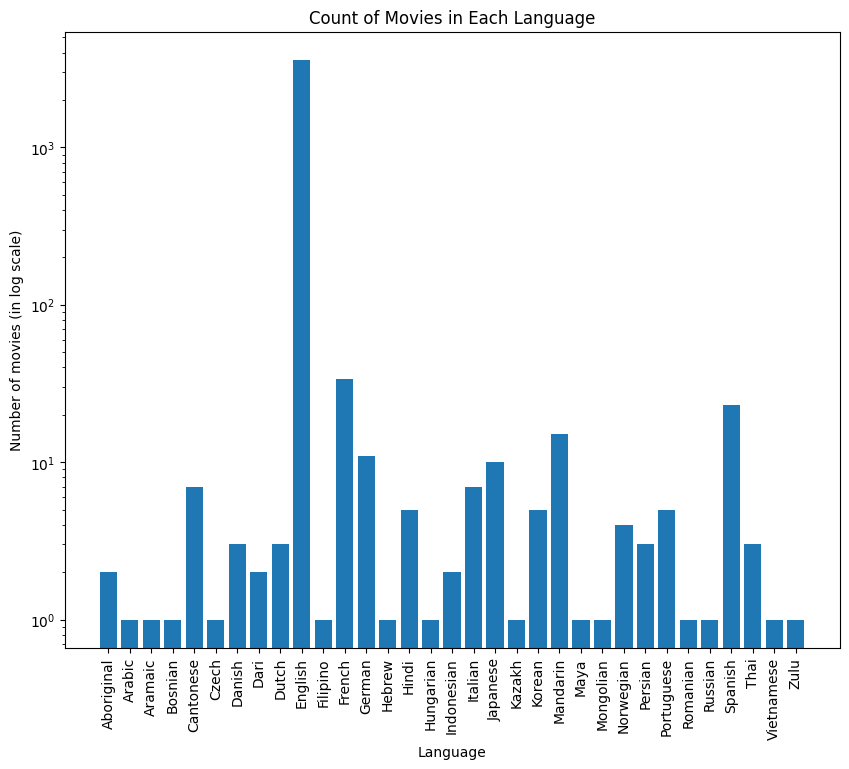
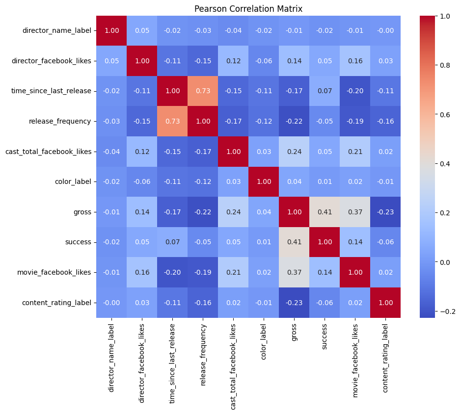

<!-- Improved compatibility of back to top link: See: https://github.com/othneildrew/Best-README-Template/pull/73 -->

<h1 align="center">Problem 1: Data Science Challenge</h3>

<!-- TABLE OF CONTENTS -->
<details>
  <summary>Table of Contents</summary>
  <ol>
    <li>
      <a href="#requirements">Requirements</a>
    </li>
    <li>
      <a href="#the-goal">The Goal</a>
    </li>
    <li>
      <a href="#features-in-the-data">Features in the data</a>
    </li>
    <li>
      <a href="#visualization">Visualization </a>
    </li>
    <li>
      <a href="#sub-task-1-predicting-next-movie-year">SubTask1 : Predicting the next movie year </a>
    </li>
    <li>
      <a href="#sub-task-2-genre-prediciton">SubTask2: Predicting the genre of next movie </a>
    </li>
    <li>
      <a href="#result">Results </a>
    </li>
  </ol>
</details>

## Requirements

Ensure you have the following packages installed:

- `pandas` : For data manipulation and analysis.
- `numpy` : For numerical operations and array manipulation.
- `tqdm` : For displaying progress bars during data processing.
- `datetime`: For handling date and time objects.
- `seaborn` : For data visualization.
- `matplotlib` : For creating plots and visualizations.
- `scikit-learn` : For machine learning algorithms and evaluation metrics.
- `xgboost` : For implementing XGBoost classifier.
- `csv`: For reading and writing CSV files.
- `os`: For operating system-related functionality.

<!-- ABOUT THE PROJECT -->
## The Goal
The goal was to develop a model capable of predicting a director's next film's release year and probable genres. By analyzing existing data and creating new features, the project utilized various visualization techniques to explore feature relationships. Machine learning algorithms, including linear regression (for release year) and multi-label classification (for genre prediction), were employed to achieve the desired predictions.

## Features in the data

<details>
<summary>Initially, we had - </summary>

```python
Data columns (total 28 columns):
 #   Column                     Non-Null Count  Dtype  
---  ------                     --------------  -----  
 0   color                      5024 non-null   object 
 1   director_name              4939 non-null   object 
 2   num_critic_for_reviews     4993 non-null   float64
 3   duration                   5028 non-null   float64
 4   director_facebook_likes    4939 non-null   float64
 5   actor_3_facebook_likes     5020 non-null   float64
 6   actor_2_name               5030 non-null   object 
 7   actor_1_facebook_likes     5036 non-null   float64
 8   gross                      4159 non-null   float64
 9   genres                     5043 non-null   object 
 10  actor_1_name               5036 non-null   object 
 11  movie_title                5043 non-null   object 
 12  num_voted_users            5043 non-null   int64  
 13  cast_total_facebook_likes  5043 non-null   int64  
 14  actor_3_name               5020 non-null   object 
 15  facenumber_in_poster       5030 non-null   float64
 16  plot_keywords              4890 non-null   object 
 17  movie_imdb_link            5043 non-null   object 
 18  num_user_for_reviews       5022 non-null   float64
 19  language                   5029 non-null   object 
 20  country                    5038 non-null   object 
 21  content_rating             4740 non-null   object 
 22  budget                     4551 non-null   float64
 23  title_year                 4935 non-null   float64
 24  actor_2_facebook_likes     5030 non-null   float64
 25  imdb_score                 5043 non-null   float64
 26  aspect_ratio               4714 non-null   float64
 27  movie_facebook_likes       5043 non-null   int64 
 ```

</details><br>

We added modified the structure and did appropriate our one hot encoding.

<details>
<summary> So the final structure looks like - </summary>

```python
Data columns (total 63 columns):
 #   Column                     Non-Null Count  Dtype         
---  ------                     --------------  -----         
 0   color                      3769 non-null   object        
 1   director_name              3769 non-null   object        
 2   num_critic_for_reviews     3769 non-null   float64       
 3   duration                   3769 non-null   float64       
 4   director_facebook_likes    3769 non-null   float64       
 5   actor_3_facebook_likes     3769 non-null   float64       
 6   actor_2_name               3769 non-null   object        
 7   actor_1_facebook_likes     3769 non-null   float64       
 8   gross                      3769 non-null   float64       
 9   genres                     3769 non-null   object        
 10  actor_1_name               3769 non-null   object        
 11  num_voted_users            3769 non-null   int64         
 12  cast_total_facebook_likes  3769 non-null   int64         
 13  actor_3_name               3769 non-null   object        
 14  facenumber_in_poster       3769 non-null   float64       
 15  num_user_for_reviews       3769 non-null   float64       
 16  language                   3769 non-null   object        
 17  country                    3769 non-null   object        
 18  content_rating             3769 non-null   object        
 19  budget                     3769 non-null   float64       
 20  title_year                 3769 non-null   float64       
 21  actor_2_facebook_likes     3769 non-null   float64       
 22  imdb_score                 3769 non-null   float64       
 23  aspect_ratio               3769 non-null   float64       
 24  movie_facebook_likes       3769 non-null   int64         
 25  Action                     3769 non-null   int64         
 26  Adventure                  3769 non-null   int64         
 27  Animation                  3769 non-null   int64         
 28  Biography                  3769 non-null   int64         
 29  Comedy                     3769 non-null   int64         
 30  Crime                      3769 non-null   int64         
 31  Documentary                3769 non-null   int64         
 32  Drama                      3769 non-null   int64         
 33  Family                     3769 non-null   int64         
 34  Fantasy                    3769 non-null   int64         
 35  Film-Noir                  3769 non-null   int64         
 36  History                    3769 non-null   int64         
 37  Horror                     3769 non-null   int64         
 38  Music                      3769 non-null   int64         
 39  Musical                    3769 non-null   int64         
 40  Mystery                    3769 non-null   int64         
 41  Romance                    3769 non-null   int64         
 42  Sci-Fi                     3769 non-null   int64         
 43  Sport                      3769 non-null   int64         
 44  Thriller                   3769 non-null   int64         
 45  War                        3769 non-null   int64         
 46  Western                    3769 non-null   int64         
 47  color_label                3769 non-null   int64         
 48  director_name_label        3769 non-null   int64         
 49  actor_2_name_label         3769 non-null   int64         
 50  genres_label               3769 non-null   int64         
 51  actor_1_name_label         3769 non-null   int64         
 52  actor_3_name_label         3769 non-null   int64         
 53  language_label             3769 non-null   int64         
 54  country_label              3769 non-null   int64         
 55  content_rating_label       3769 non-null   int64         
 56  title_year_DateStamp       3769 non-null   datetime64[ns]
 57  time_since_last_release    3769 non-null   float64       
 58  number_of_movies           3769 non-null   int64         
 59  release_frequency          3769 non-null   float64       
 60  collaboration              3769 non-null   int64         
 61  collaboration_likes        3769 non-null   float64       
 62  success                    3769 non-null   int32         
```
</details>


## Visualization

<figure>
  
  <figcaption>The figure suggests that the <b>number of movies produced</b> increased with each passing year with maximum around 2000 and 2010.</figcaption>
</figure>
 
 ---

<figure>
  
  <figcaption>The figure suggests that the <b>number of movies produced in each genre</b> has increased with each passing year with <b>maximum around 2000 and 2010</b>.</figcaption>
</figure>

---

<figure>
  
  <figcaption>The figure shows the <b>budget of movies over the years</b> and if they were <b>successful or fail</b>. We can see that a low budget movie is more prone fail and high budget movies are more likely to be a success.
  Also, the budget is growing with the passing years.</figcaption>
</figure>

---

<figure>
  
  <figcaption>The figure shows the movies-genre distribution in the dataset - are not distributed evenly. The top 3 genre are Drama, Comedy, and Thriller.</figcaption>
</figure>

---

<figure>
  
  <figcaption>The figure shows the distribution of movies in differnet languages.</figcaption>
</figure>

---

<div style= "display: flex; justify-content:space-between;">
<figure>
  
  <figcaption><b>Pearson correlation matrix</b> visualizing relationships between features.</figcaption>
</figure>
<figure>
  
  <figcaption><b>Spearman correlation matrix</b> visualizing relationships between features.</figcaption>
</figure>
</div>

---

## Sub-Task 1: Predicting next movie year
- The dataset with new features were divided into training and testing sets (70 - 30 split).
- We evaluated multiple regression algorithms for time prediction, including **linear regression**, **Random Forest Regressor**, **Gradient Boosting Regressor**, **AdaBoost Regressor**, and **Support Vector Regressor** (SVR). The best performing model was chosen based on its performance on the training data. 
-  Once trained, the chosen model's performance was assessed on the unseen testing set. We employed several metrics to gauge accuracy:

   - <u>Mean Squared Error (MSE)</u>: Measures the average squared difference between predicted and actual release years. (lower is better)
   - <u>Mean Absolute Error (MAE)</u>: Calculates the average of the absolute differences between predicted and actual release years. (lower is better)
   - <u>R-squared ($R^2$)</u>: Represents the proportion of variance in release years explained by the model. (higher/closer to 1 is better)

## Sub-Task 2: Genre Prediciton
- The dataset with new features were divided into training and testing sets (70- 30 split).
- We explored multi-label classification algorithms, like **MultiOutputClassifier** with Random Forest Classifier and AdaBoost Classifier, to identify the most effective model. MultiOutputClassifier acts as a wrapper around a single classifier, enabling it to predict multiple genres simultaneously and offering flexibility in choosing the best base model.
- We trained our model on the data, enabling it to learn the relationships between the features and movie genres.
- Model performance was assessed using precision_score, recall_score, and F1-score.
    - <u>Precision</u>: Proportion of predicted genres that are actually correct (higher is better).
    - <u>Recall</u>: Proportion of actual genres that are correctly identified by the model (higher is better).
    - <u>F1-score</u>: Harmonic mean between precision and recall, balancing both (higher/closer to 1 is better).

## Result

### For Sub-Task 1

| Model | Mean Squared Error | Mean Absolute Error | R-squared |
|-|-|-|-|
| Random Forest Regressor | 25.42 | 3.10 | 0.75 |
| Gradient Boosting Regressor | 22.06 | 2.87 | 0.78 |
| Support Vector Regressor | 103.51 | 7.08 | -0.02 |
| **AdaBoost Regressor** | **21.71** | **2.86** | **0.79** |

### For Sub-Task 2

| Model | Model Accuracy | Precision | Recall | F1 Score |
|-|-|-|-|-|
| Random Forest Classifier | 0.0813 | 0.6341 | 0.3112 | 0.3698 |
| AdaBoost Classifier | 0.0566 | 0.5197 | 0.3191 | 0.3680 |
| **XGBoost Classifier** | **0.09903** | **0.5552** | **0.4022** | **0.4490** | 

---
---

<h3 align="center"> - x - X - x -</h3>
